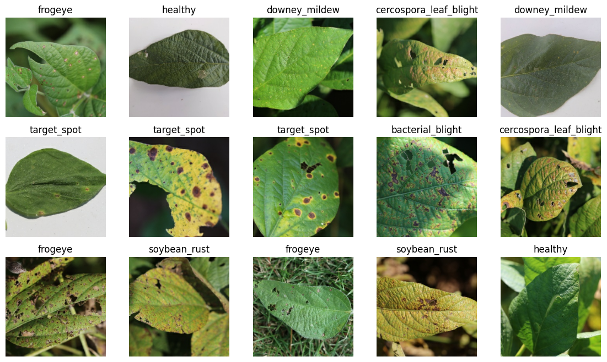

<h1>Soybean Leaf Disease Detection and Yield Prediction</h1>
<h3>Big Data Technologies - Mini Project</h3>

  Developing a system to detect various diseases from images of soybean plant leaves. This will enable farmers to detect crop failures early and take appropriate steps to reduce further yield loss.

